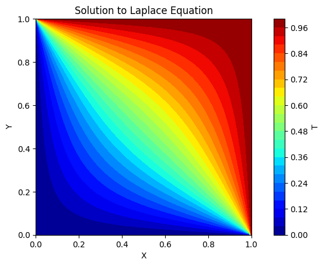
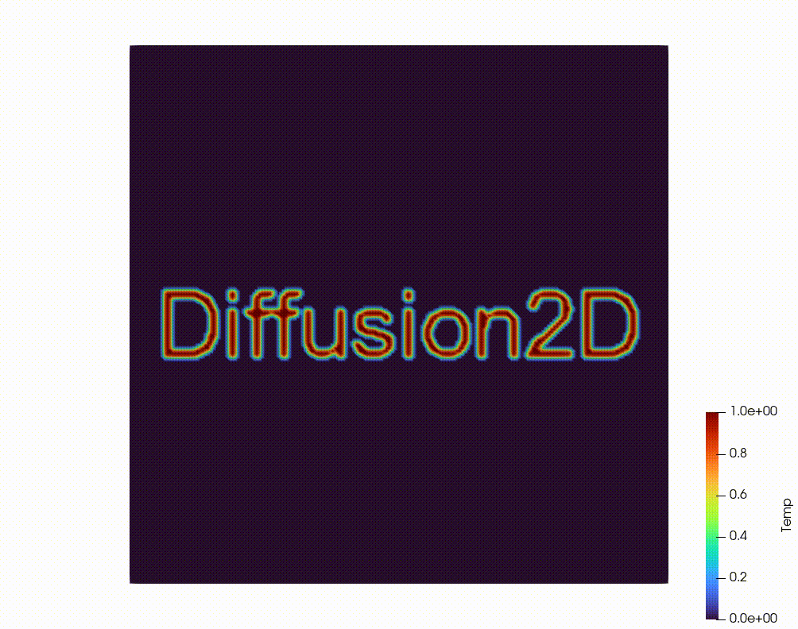

# Diffusion2D

## Overview
Diffusion2D is a numerical solver for 2D diffusion equations, implemented using central differencing for spatial discretization and the forward Euler method for time integration.
**Features**
- Steady state solver (uses `Eigen`'s conjugate gradient linear solver)
- Transient solver (forward differencing)
- UDF support (functions of time) using LuaJIT
- Paraview VTR (rectilinear) mesh output
- Python bindings

## Equations
The solver handles the following equations:

1. **Laplace Equation:**
   ```math
   \nabla^2 T = 0
   ```

2. **Poisson Equation:**
   ```math
   \nabla^2 T + f = 0
   ```
   Here, `f` represents the source term.

3. **Unsteady Diffusion Equation:**
   ```math
   \nabla^2 T + f = \frac{\partial T}{\partial t}
   ```

## Methods
The numerical methods used are:
- **Spatial Discretization:** Central differencing
- **Time Integration:** Forward differencing

## Example Solutions
### Steady State Laplace


### Transient Diffusion
Using the Python bindings, arbitrary initial conditions can be specified to the solver.



### Transient Simulation with UDFs
UDFs can be specified using valid lua code, either by direct text (string) input, or by specifying a lua script. The lua code is jit compiled (LuaJIT) for **_near C_** performance without need to recompile.


## Installation
This was developed on Windows 10 using MSVC 2022, C++ Standard 17, and Python 3.11. The included `.sln` (msvc solution file) requires that you have the path to your python installation in an environment variable called `PYTHON_HOME`. It also requires that you build LuaJIT (included as a submodule) for whatever architecture that you're using. In totality, this project depends on Eigen, TinyXML2, pybind11, and LuaJIT.
You can start by:
- `git clone --recursive https://github.com/ddm-j/Diffusion2D.git`
- Fire up a MSVC Developer console for whatever architecture (x64, 32)
- `cd external/LuaJIT/src`
- `msvcbuild.bat` (this will build LuaJIT. If you need the debug config build as well, use `msvcbuild.bat debug`)
- Copy the newly built `lua51.dll` file from `external/LuaJIT/src` to `bin` (of the root directory)
- Open the main solution file in MSVC
- Switch to the `PythonBindings` configuration and build

It would make it easier on you for me to just publish this on `PyPy` or something, but I can't be bothered. If you've found your way to this strange corner of the internet, you can build this project yourself.

## Useage
You really want to use this? There are instructions that are somewhat decently documented in the [Diffusion2D](py/Diffusion2D.ipynb) Jupyter notebook which is in the `py` folder.
